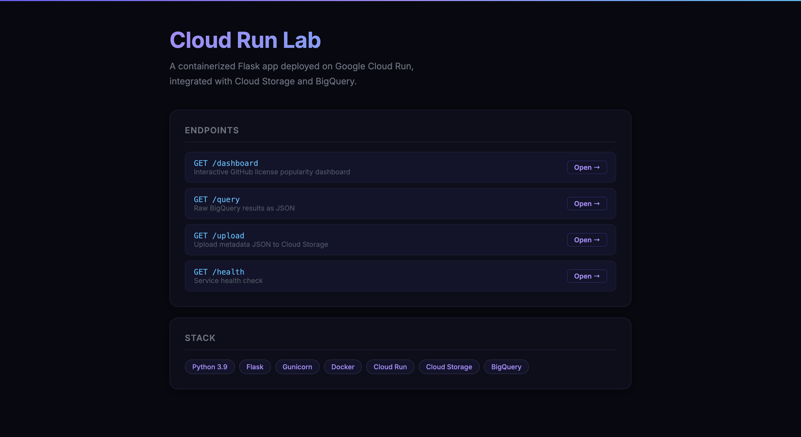
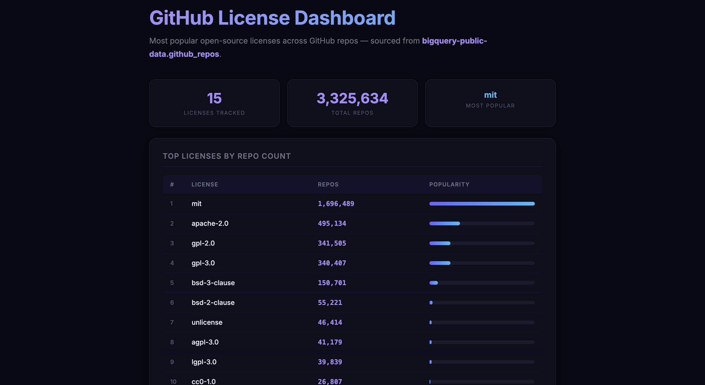
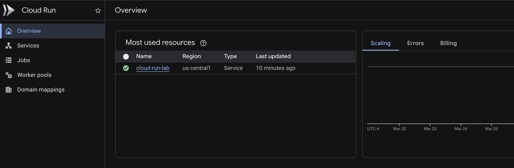
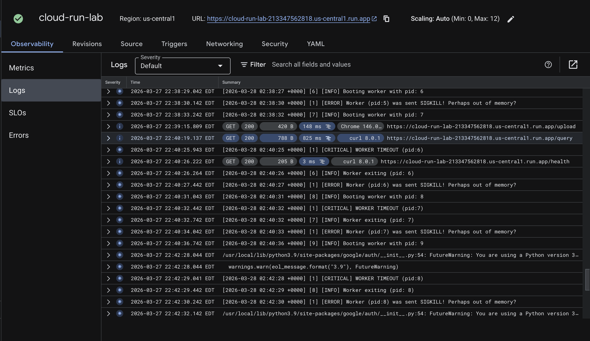
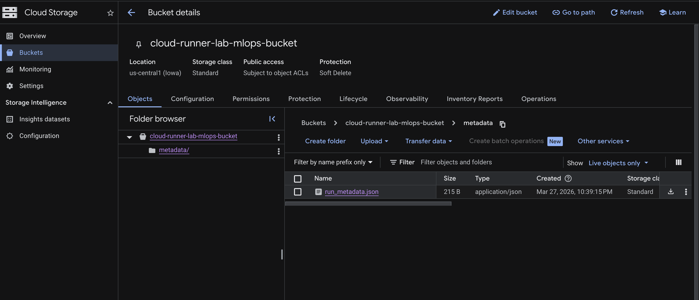

# Cloud Run Lab

A containerized Flask web application deployed on **Google Cloud Run**, integrated with **BigQuery** and **Cloud Storage**.Queries the GitHub public dataset on BigQuery.

**Live URL:** https://cloud-run-lab-213347562818.us-central1.run.app

---

## Screenshots

### Home Page


### BigQuery Dashboard


### Cloud Run Service (GCP Console)


### Cloud Run Logs


### Cloud Storage Bucket


---

## Architecture

```
Browser / curl
      │
      ▼
┌─────────────────────────────┐
│       Google Cloud Run      │  ← Serverless, auto-scaling
│   (cloud-run-lab service)   │
│                             │
│  Flask + Gunicorn (2 workers)│
└──────────────┬──────────────┘
               │
       ┌───────┴────────┐
       ▼                ▼
┌─────────────┐  ┌──────────────────┐
│  BigQuery   │  │  Cloud Storage   │
│ (github_    │  │  (metadata/      │
│  repos.     │  │   run_metadata   │
│  licenses)  │  │   .json)         │
└─────────────┘  └──────────────────┘
```

**Container flow:**
1. Docker image built for `linux/amd64` and pushed to **Google Container Registry**
2. Cloud Run pulls the image and runs it on managed infrastructure
3. Service account grants the container permission to read BigQuery and write to Cloud Storage
4. `BUCKET_NAME` environment variable is injected at deploy time
---

## Project Structure

```
CloudRunnerLab/
├── app.py              # Flask application (all routes + HTML)
├── Dockerfile          # Container definition
├── requirements.txt    # Python dependencies
├── .dockerignore       # Files excluded from Docker build
└── screenshots/        # UI and console screenshots
```

---

## Endpoints

### `GET /`
Landing page listing all available endpoints with a tech stack overview.

### `GET /dashboard`
Interactive HTML dashboard showing the top 15 open-source licenses by GitHub repo count. Includes:
- Summary stat cards (licenses tracked, total repos, most popular)
- Sortable table with gradient popularity bars
- Sourced live from BigQuery on each request

### `GET /query`
Returns the same data as `/dashboard` but as raw JSON — useful for downstream integrations.

**Sample response:**
```json
{
  "status": "ok",
  "count": 15,
  "data": [
    { "license": "mit",        "repo_count": 1696489 },
    { "license": "apache-2.0", "repo_count": 495134  },
    { "license": "gpl-2.0",   "repo_count": 341505  },
    { "license": "gpl-3.0",   "repo_count": 340407  },
    { "license": "bsd-3-clause","repo_count": 150701 },
    ...
  ]
}
```

### `GET /upload`
Uploads a JSON metadata file to Cloud Storage at `metadata/run_metadata.json`.

**Sample response:**
```json
{
  "status": "ok",
  "message": "Uploaded metadata/run_metadata.json to cloud-runner-lab-mlops-bucket",
  "metadata": {
    "app": "cloud-run-lab",
    "uploaded_at": "2026-03-28T02:27:28.691410Z",
    "version": "1.0.0",
    "dataset": "bigquery-public-data.github_repos.licenses",
    "description": "GitHub repo license metadata snapshot"
  }
}
```

### `GET /health`
Lightweight health check endpoint — returns service name and current UTC timestamp.

**Sample response:**
```json
{
  "service": "cloud-run-lab",
  "status": "healthy",
  "timestamp": "2026-03-28T02:40:26.227846Z"
}
```

---

## Setup & Deployment

### Prerequisites
- [Google Cloud SDK](https://cloud.google.com/sdk/docs/install) installed and authenticated
- [Docker Desktop](https://www.docker.com/products/docker-desktop/) installed and running
- A Google Cloud project with billing enabled
- GitHub CLI (`gh`) — optional, for repo setup

### 1. Clone the repo

```bash
git clone https://github.com/Malav2002/CloudRunnerLab.git
cd CloudRunnerLab
```

### 2. Set your project variables

```bash
export PROJECT_ID=your-project-id
export BUCKET_NAME=your-bucket-name
export REGION=us-central1
export SA_EMAIL=cloud-run-sa@${PROJECT_ID}.iam.gserviceaccount.com
```

### 3. Enable required APIs

```bash
gcloud services enable \
  run.googleapis.com \
  storage.googleapis.com \
  bigquery.googleapis.com \
  containerregistry.googleapis.com \
  --project=$PROJECT_ID
```

### 4. Create Cloud Storage bucket

```bash
gsutil mb -p $PROJECT_ID -l $REGION gs://$BUCKET_NAME
```

### 5. Create and configure a service account

```bash
gcloud iam service-accounts create cloud-run-sa \
  --display-name="Cloud Run Service Account" \
  --project=$PROJECT_ID

gcloud projects add-iam-policy-binding $PROJECT_ID \
  --member="serviceAccount:$SA_EMAIL" --role="roles/storage.admin"

gcloud projects add-iam-policy-binding $PROJECT_ID \
  --member="serviceAccount:$SA_EMAIL" --role="roles/bigquery.user"

gcloud projects add-iam-policy-binding $PROJECT_ID \
  --member="serviceAccount:$SA_EMAIL" --role="roles/bigquery.dataViewer"
```

### 6. Build and push the Docker image

> **Note:** The `--platform linux/amd64` flag is required when building on Apple Silicon (M1/M2/M3) macs.

```bash
gcloud auth configure-docker

docker buildx build \
  --platform linux/amd64 \
  -t gcr.io/$PROJECT_ID/cloud-run-lab \
  --push .
```

### 7. Deploy to Cloud Run

```bash
gcloud run deploy cloud-run-lab \
  --image gcr.io/$PROJECT_ID/cloud-run-lab \
  --region $REGION \
  --platform managed \
  --allow-unauthenticated \
  --update-env-vars BUCKET_NAME=$BUCKET_NAME \
  --service-account $SA_EMAIL \
  --project $PROJECT_ID
```

### 8. Get the service URL

```bash
gcloud run services describe cloud-run-lab \
  --platform managed \
  --region $REGION \
  --format "value(status.url)" \
  --project $PROJECT_ID
```

---

## Changes

| Feature | Base Lab | This Lab |
|---|---|---|
| Dataset | USA baby names (Texas) | GitHub public repo licenses |
| Upload format | Plain `.txt` file | Versioned JSON metadata |
| API response | Plain text strings | Structured JSON |
| UI | None | Dark-themed HTML dashboard |
| Dashboard | None | Live stat cards + table + progress bars |
| Extra endpoints | None | `/dashboard`, `/health` |
| Docker base | `python:3.9` | `python:3.9-slim` (smaller image) |
| Gunicorn workers | 1 | 2 (better concurrency) |

---
---

## Monitoring & Logs

### View logs in terminal

```bash
gcloud run services logs read cloud-run-lab \
  --region us-central1 \
  --project $PROJECT_ID \
  --limit 50
```

---

## Cleanup

Remove all resources to avoid charges:

```bash
# Delete Cloud Run service
gcloud run services delete cloud-run-lab --region us-central1 --project $PROJECT_ID

# Delete container image
gcloud container images delete gcr.io/$PROJECT_ID/cloud-run-lab --force-delete-tags

# Delete Cloud Storage bucket
gsutil rm -r gs://$BUCKET_NAME

# Delete service account
gcloud iam service-accounts delete $SA_EMAIL --project $PROJECT_ID

# Delete project (optional)
gcloud projects delete $PROJECT_ID
```

---

## Dataset

**`bigquery-public-data.github_repos.licenses`**

This public BigQuery dataset contains license metadata for millions of open-source GitHub repositories. The app queries the top 15 licenses by repo count, giving a real-time snapshot of open-source licensing trends.

| Field | Type | Description |
|---|---|---|
| `repo_name` | STRING | GitHub repository name (owner/repo) |
| `license` | STRING | SPDX license identifier (e.g. `mit`, `apache-2.0`) |

